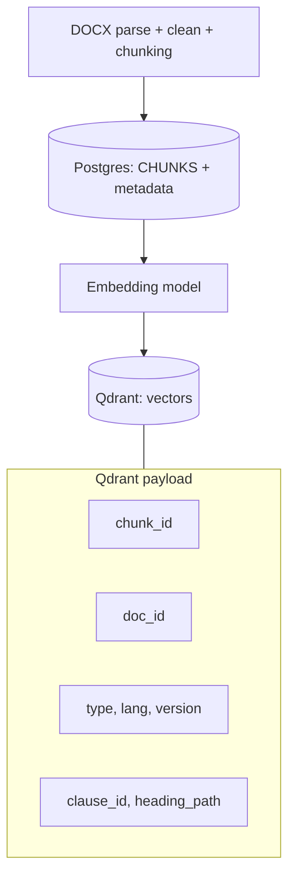
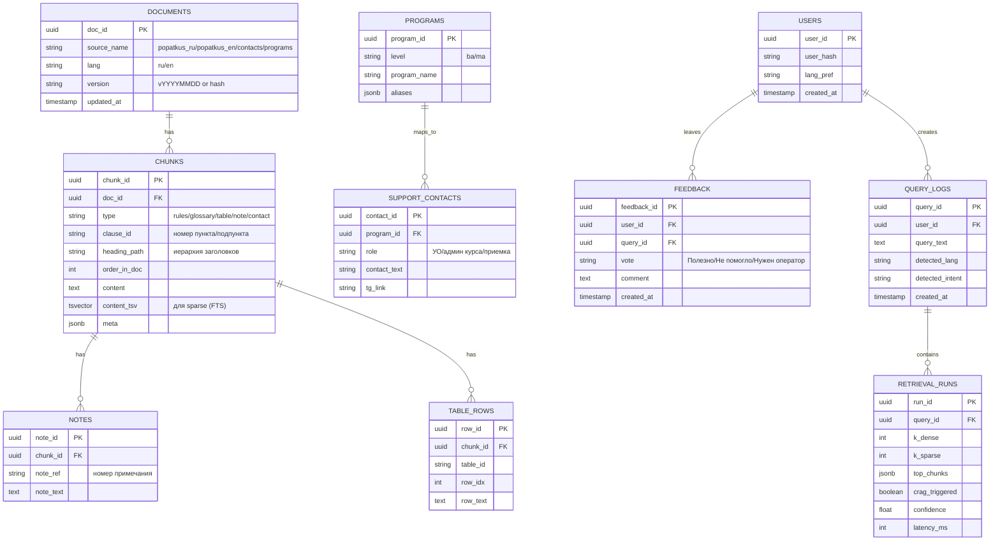

# Design-Doc: Чат-бот / RAG-система

## 1. Контекст проекта

### 1.1 Бизнес-задача

- **Бизнес-цель:** Целью внедрения данного проекта является снижение нагрузки на поддержку НИУ ВШЭ в пиковые сезоны (сессии, пересдачи, восстановления, а также поступление). Типовые запросы значительно повышают время ответа, что увеличивает размер очереди. А также представленные источники информации требуют самостоятельного изучения, что также затрудняет сам процесс. В сессию и период пересдач суммарно приходит около 15.000 сообщений поддержке, на каждое из которых необходимо ответить. Поэтому разработка чат-бота который будет отвечать на основе единого документа, актуальна как способ снизить нагрузку на поддержку, а также повысить скорость получения необходимой информации.
- **Почему станет лучше, чем сейчас, от использования ML:** RAG чат-бот при генерации ответа опирается на документ, в нашем случае "Попаткус", с приложением цитирования на фрагмент, как подтверждение корректности ответа, тем самым снижая вероятность галлюцинаций. Это значительно ускоряет генерацию ответов на типовые вопросы пользователей и повышает доступность. Также, при возможном обновлении исходного документа "Попаткус", система выполняет переиндексацию базы, текст повторно разбивается на фрагменты, для каждого фрагмента пересчитываются эмбеддинги и обновляются записи в векторном хранилище, что гарантирует актуальность и минимизирует вероятность выдачи устаревшей информации.
- **Что будем считать успехом с точки зрения бизнеса:** Минимизация доли неподтвержденных ответов и времени ответа системы. Также будет фиксироваться доля ответов подтвержденных источником, с ссылкой на релевантные фрагменты. Отдельно будет фиксироваться пользовательская оценка полезности. Также будет фиксироваться доля вопросов решенных без поддержки.

### 1.2 Целевая аудитория и пользователи

- **Кто будет пользоваться ботом:** Чат-ботом будут пользоваться студенты и абитуриенты НИУ ВШЭ.
- **Сценарии использования:** Основной способ общения происходит через текстовый диалог в Telegram-боте, это обеспечивает доступность и низкий порог входа. В дальнейшем возможно расширение интерфейсов: веб-виджет для сайта приемной комиссии.
- **Предполагаемая нагрузка:** В пиковые сезоны - период сессий, пересдач, восстановления и приемной кампании, ожидается наибольшая нагрузка на систему. В эти периоды возрастет доля типовых запросов, для которых требуется быстрый и точный ответ с ссылкой на фрагменты документа.

### 1.3 Ограничения и допущения

- **Что система не будет делать:** Система не выражает персональную оценку по вопросам непосредственно связанных с обучением, если в базе знаний не представлены подходящие фрагменты, система сообщает об этом и предлагает обратиться в поддержку.  
  Также система не будет отвечать на вопросы вне тематики обучения. И система не будет давать ответы которые нельзя найти в Попаткусе. Отдельно стоит запрет на ненормативную лексику и оскорбления. При возникновении спорных вопросов будет рекомендовать обратиться в поддержку.
- **Допущения о данных:** Единственный источник знаний - это документ "Попаткус", представленный в двух версиях на русском и английском языках (DOCX). Он разделен на разделы и доступен для парсинга. Также при обновлении документа происходит переиндексация базы, что гарантирует актуальность.
- **Допущения об инфраструктуре:** Векторное хранилище Qdrant разворачивается на сервере проекта. Используется локальнаая или open-source LLM-модель, в рамках ограниченности ресурсов. Telegram выбран как основной интерфейс, в дальнейшем возможно расширение интерфейсов: веб-виджет для сайта приемной комисии.
- **Допущения о нормативах:** Ответы должны быть обоснованы на источнике, иначе отказ или рекомендация обратиться в поддержку. При недостатке фрагментов, система не додумывает. Также обязателен запрет на ненормативную лексику, оскорбления и персональную оценку.

## 2. Архитектура решения

### 2.1 Общая схема

- **Диаграмма архитектуры:** User (Telegram) -> Telegram Bot API -> aiogram backend -> RAG движок -> Retrieval (Qdrant dense + sparse BM25) -> RRF -> CRAG -> rerank -> сборка промта -> LLM -> Verifier (NLI) -> UI форматирование (цитирование + ответ) -> Telegram.  
   БД: Postgres (метаданные, чанки, логи), Qdrant.  
   BM25 sparse index (поиск для аббревиатур - КУД, ИУП и так далее).  
  
- **Основные компоненты и их роли:**  
  aiogram backend: принимает сообщения/кнопки, хранит state диалога, логирует метрики, вызывает RAG-движок.  
  RAG движок: нормализует запрос, определяет язык и запрос, запускает retrieval/CRAG/rerank, собирает промпт, вызывает LLM, проверяет ответ, формирует финальный ответ.  
  Qdrant (vector DB): хранит эмбеддинги чанков + метаданные, отдает dense top@30.  
  Sparse index (BM25): отдаёт sparse top@30 по точным терминам и аббревиатурам (из-за малого объема данных k = 30).  
  LLM: генерирует ответ строго по контексту.  
  Verifier (NLI + правила): проверяет, что ответ поддерживается контекстом.  
  Postgres: хранит метрики, справочники, чанки и метаданные версий документов.

### 2.2 Хранилище знаний / документооборот

- **Источники знаний:**
  Основной документ - это регламент внутренних правил НИУ ВШЭ "Попаткус", представленный на двух языках (Русский и Английский). Также, для предоставления контактов поддержки пользователю (если запрос персональный или спорный) хранятся справочники (Для образовательных программ бакалавриата/магистратуры и справочник контактов с привязкой к курсу и образовательной программе пользователя).
- **Где храним и в каком виде:**
  Исходные документы хранятся в репозитории проекта. PostgreSQL хранит метаданные документов и версий + тексты чанков и метаданные, справочники, а также логи + фидбек.  
  Qdrant хранит embeddings для чанков + метаданные (chunk_id/doc_id/lang/type/clause_id/version) для фильтрации и цитирования.  
  Sparse index (BM25) хранит отдельный индекс для ключевых слов, используется для улучшения recall по аббревиатурам или терминам и точным совпадениям. Хранится как инвертированный индекс в виде файла на volume и загружается приложением в память.
- **Пайплайн обновления:**
  Загружаем новую версию документов в формате DOCX (обновление происходит редко и вручную, по факту выхода новой редакции документа). Затем парсим документ - извлекаем структуру (заголовки, пункты, списки, таблицы, примечания) и очищаем текст от мусора (колонтитулы и номера страниц). Затем производим чанкинг (350–450 токенов, поскольку в Попаткусе пункты разные по размеру, overlap 60–80), таблицы индексируем отдельно (одна строка = один чанк), глоссарий - отдельно (один термин = один чанк), так как один и тот же тремин может быть сформулирован по разному (ИУП = индивидуальный учебный план). Повторно считаем эмбеддинги и обновляем индексы (dense в Qdrant + sparse BM25). Обновляем индекс (version) и при ошибках делаем безопасный откат на прошлую версию.
- **Как часто обновляем:**
  Так как сам документ обновляется редко, то подойдет ручная проверка документа на сайте раз в 90 дней, в последующем происходит весь пайплайн обновления.

### 2.3 Retrieval + Generation

- **Retrieval:** Основной поиск реализован как sparse + dense (для возможных грамматических ошибок - dense, для точных аббревиатур и терминов - sparse). Dense поиск выполняется в Qdrant по эмбеддингам, для эмбеддингов была выбрана модель e5-large-instruct, поскольку поддерживает мультиязычность и лимит по токенам нам подходит, также по метрике nDCG@10 показывает хорошие результаты. Результаты объединяются через RRF, далее применяется rerank (кросс-энкодер для первых 20, так как это довольно затратная операция) для отбора наиболее релевантных фрагментов. Так как документы небольшие, суммарно 80 страниц, то можно брать `k = 30` для dense и sparse поиска. Для RRF можно взять `k = 60`, и для cross-encoder `top k = 5-10`.
- **Generation:** LLM будет выбираться в дальнейшем по метрикам качества/стоимости/латентности. Также дополнительные требования: мультиязычность, instruction-following, контекстное окно достаточно для 6–10 чанков. Известно также что Kaggle дает 30 часов GPU - будет использовано для оффлайн тестирования LLM.
- **Контроль ответа:** качество контролируется по результатам rerank + verifier (NLI). Если после rerank нет достаточного количества релевантных фрагментов или verifier не подтверждает ответ, система не додумывает: запускает CRAG/уточнение запроса, при повторной неудаче возвращает "В документе нет прямого подтверждения" и предлагает поддержку.

### 2.4 Интеграции и интерфейсы

- **Внешние API и сервисы:** Telegram Bot API (основной чат-интерфейс). Внутренние сервисы проекта: RAG-пайплайн (retrieval/rerank/сборка промта/generation) и хранилища (Qdrant + Postgres). Внешние системы не подключаются, при сценарии "Нужен оператор" - выдача контактов из справочника (без внешних API).
- **Протоколы:** Telegram Bot API: long polling. Между ботом и RAG-модулем: либо прямые вызовы внутри приложения, либо REST (на будущее).
- **UI/UX требования:** Первое сообщение бота предоставяет пользователю кнопки (главое меню): "Задать вопрос", "Что я умею?", "Нужен оператор". При сценарии "задать вопрос" ответ формируется структурированно: краткое объяснение + цитаты (с указанием пункта/подпункта) + при необходимости расшифровка терминов. После ответа пользователю бот предложит оценить полезность ответа (кнопки): "Полезно", "Не помогло", "Нужен оператор". Если не найдено подтверждение: "В документе нет прямого подтверждения" + кнопки "Уточнить вопрос"/"Нужен оператор". Если же пользователь выбрал вариант "Нужен оператор": кнопками уточняем уровень/курс, затем просим название программы текстом и выдаем контакты из справочника.
- **Мониторинг:** Логирование в Postgres: время ответа (total, retrieval, rerank, LLM, verifier), выбранный язык, маршрут (задать вопрос/оператор/отказ/уточнение), наличие цитат, оценка пользователя, факт "решено без поддержки". Фиксируются также доля ответов без цитат, доля переходов в поддержку, ошибки retrieval/LLM.

### 2.5 Инфраструктура и развертывание

- **Архитектурный стек:** 3 контейнера Docker - app: aiogram backend + RAG-логика (retrieval/RRF/CRAG/rerank, сборка промпта, вызов LLM, verifier, FSM, API)  
  postgres: метаданные чанков и версий документов, логи, фидбек, справочники контактов и программ  
  qdrant: dense embeddings + payload (chunk_id/doc_id/lang/type/version/clause_id)  
  BM25: реализован внутри app как локальный индекс (файл на volume + загрузка в память) и используется вместе с dense retrieval из Qdrant (hybrid retrieval).  
  Развертывание: Docker Compose (локальная разработка и демонстрация).
- **Среды:**
  dev: локальная разработка (docker compose), тестовый Telegram-бот, тестовые токены и отдельная БД  
  test: прогон golden set, проверка метрик и качества ответов, тест переиндексации  
  prod: используются отдельные токены и отдельные пространства данных (другая база в Postgres и другая коллекция в Qdrant), чтобы тестовые изменения не влияли на пользователей  
  Разделение по окружениям делается через переменные окружения (ENV=dev/test/prod) и разные конфиги (URL БД, токены, включение дебага, лимиты).
- **Требования к вычислениям:** LLM через API достаточно CPU.  
   app: 2–4 vCPU, 2-4 GB RAM, диск 5–10 GB  
   postgres: 1 vCPU, 1-2 GB RAM, диск 10–20 GB (логи/чанки/версии)  
   qdrant: 2 vCPU, 1-2 GB RAM, диск 5–10 GB (объем небольшой - 2 документа + справочники)  
   Итого для одного VPS (DigitalOcean): комфортный минимум 4 GB RAM / 2 vCPU (например Basic droplet), чтобы одновременно держать app + postgres + qdrant.  
   Rerank и Verifier могут быть реализованы в двух режимах:
  CPU/inference-режим: запуск на CPU (локально или на сервере) - выше latency, но подходит для демо и малого объема данных.  
  GPU-режим: ускорение на GPU для снижения задержки при росте нагрузки.
- **Безопасность:** Секреты: Telegram Bot Token, пароли Postgres, ключи доступа к LLM (если будут) - только через переменные окружения и секреты, не коммитятся в репозиторий.  
  Доступы: Postgres ограничен внутренней сетью, aiogram получает обновления через исходящие HTTPS-запросы к Telegram и не требует публичного входящего endpoint. RAG-логика вызывается внутри приложения.  
  Минимизация данных: в логах хранится минимум, который нужен для сбора статистики - тайминги, метрики, наличие цитат  
  user_id хранится как хэш для безопасности  
  сырые тексты - ограниченное время (30 дней).  
  Защита от злоупотреблений - ограничение частоты запросов и длины входного сообщения, чтобы избежать спама и перегрузки  
  Контент-фильтры: при нахождении в сообщении пользователя отсутствие вопроса про обучение (не по теме) бот отвечает: "В документе нет прямого подтверждения".  
  Обновление и откат: документы и индексы версионируются, новая версия становится активной только после успешной переиндексации. При сбое система остается на предыдущей активной версии.
- **Масштабирование:** Горизонтальное: можно запускать несколько копий app. Состояние диалога (FSM) хранится в PostgreSQL, поэтому любая копия app может обработать следующее сообщение пользователя и продолжить сценарий.  
  Деградация по нагрузке: уменьшение k для rerank, ограничение числа чанков в LLM, кеширование результатов retrieval/rerank для частых вопросов (TTL).

## 3. Данные и качество знаний

### 3.1 Сбор и предобработка данных

- **Источники:** Основной источник данных - документ "Попаткус", в русской и английской версиях - для иностранных студентов и абитуриентов. На данный момент эти документы представлен в формате DOCX. Также дополнительные справочники при возможном сценарии обращения пользователю в поддержку (происходят только при нажатии кнопки пользователем "Нужен оператор").  
  Справочник образовательных программ - с привязкой к уровню обучения, и справочник контактов поддержки (УО, администратор курса, приемная комиссия) - с привязкой к уровню обучения и программе. Данные справочников поддерживаются как отдельные документы и обновляются вне зависимости от основного документа.
- **Шаги предобработки:**

1. **Извлечение структуры из DOCX:** сохраняются заголовки, обычный текст, примечания, списки и таблицы, и иерархия разделов. Это можно сделать с помощью **python-docx** - библиотека которая умеет читать абзацы, таблицы, стиль абзацей.
2. **Очистка текста:** удаление колонтикулов, номера страниц (так как бот будет выдавать ссылку на фрагмент + определенный пункт или подпункт без привязки к странице), переносы строк.
3. **Разбиение на чанки:** документ делится на фрагменты по логическим границам, `размер чанка = 350-450 токенов` и `overlap = 60-80`. Таблицы (их в Попаткусе всего 2) индексируются отдельно (один строка = один чанк), с добавлением контекста из ближайшего пункта. Примечания хранятся отдельно и связаны с пунктом, где встречается ссылка на данное примечание.
4. **Выделение глоссария:** поскольку возможны сценарии разных интерепретаций одной вещи (например ИУП = индивидуальный учебный план, а BM25 не найдет таким образом нужный фрагмент, но найдет в глоссарии), сохраняем как отдельный тип (`type=glossary`) для каждого чанка (один термин = один чанк), далее ретривер делает быстрый проход по глоссарию, находит расшифровку и делает расширенный поиск по общему тексту регламента, вместе с данной расшифровкой.
   PostgreSQL - хранит текст чанков + метаданные + версии документов + справочники + логи/оценки. Qdrant - хранит эмбеддинги и минимум метаданых (`chunk_id`, `doc_id`, `lang`, `type`, `version`) для фильтрации.

- **Метаданные:** Из метаданных мы будем хранить для каждого фрагмента тип информации: `type=glossary/rules/table/note/contact`. Также будем хранить идентификатор документа `doc_id = popatkus_ru/popatkus_en/contacts/programs`. Обязательно хранение языка `lang=ru/en`, и `heading_path` - для иерархии. Для правильного цитирования храним номер пункта - `clause_id`. Для таблиц `table_id`, `row_idx`. Для правильного версионирования, храним `version`.

### 3.2 Векторизация и индексирование

- **Какая модель была выбрана для embedding:** Так как наш основной документ "Попаткус" представлен в версиях на русском и на английском языках, и сами пользователи могут писать запрос на обоих языках, было принято решение выбрать модель - **multilingual-e5-large-instruct**. Эта модель поддерживает мультиязычность, и по данным статьи 2024 года модель достигает среднего результата в 65.7% по метрике nDCG@10, и лимит по токенам - 512. Также будет использована как dense-retriever для семантического поиска, поскольку заявляется что ее необходимо использовать с дополнительной инструкцией, это поможет анализировать запросы с ошибками. Также, так как в "Попаткусе" достаточно много внутренних аббревиатур и терминов, добавлен BM25 - sparse поиск, для повышения recall по таким ключевым словам, с последующим rerank.
- **Параметры индекса:** Векторное хранилище - Qdrant. Для векторного поиска используется ANN-индекс. Используется конфигурация 1 shard + 1 replica из-за малого объема данных (2 документа + справочник) и нацеленность на простоту эксплуатации. Для e5 метрика - cosine.
- **Стратегии обновления:** Документ "Попаткус" обновляется нечасто, поэтому основная стратегия - полная переиндексация при изменении исходного документа: повторные парсинг, пересоздание чанков, пересчет эмбеддингов затем обновление индекса. Используются индексы версионирования, это дает безопасный откат назад при ошибках обновления.

### 3.3 Метрики качества знаний

- **Покрытие:** Измеряем количество пунктов, которые попали в индекс (на каждый clause_id хотя бы один чанк). Также на "золотом наборе" фиксируем долю вопросов, где правильный пункт найден в `top k` (до и после rerank). Покрытие глоссария - процент терминов, которые есть в `type=glossary`.
- **Актуальность:** Время обновления: сколько времени занимает полная переиндексация после загрузки новой версии документа (от момента загрузки до готовности поиска).  
  Доля ответов на старой версии: процент ответов, в которых использовались чанки не из текущей активной версии индекса (в норме стремимся к 0).
- **Консистентность:** Проверяем что дублей чанков нет в одной версии.  
  Смотрим что все чанки с полными метаданными (`clause_id`, `heading_path`, `lang`, `version`) - иначе ломаются цитаты. Так как русская и английская версия семантически одинаковы, то это можно не проверять.
- **Проверка:** после любых изменений (чанкинг/retrieval+rerank/обновление версии документа) прогоняем "golden set" и проверяем, что метрики и качество цитирования не ухудшились.

## 4. Модель и генерация

### 4.1 Выбор LLM и промптинг

- **Указание модели:** выбор будет сделан после тестирования на типовых вопросах студентов/абитуриентов (RU/EN). Модель обязана быть мультиязычной, instruction-following, контекстное окно для 6-8 чанков, стабильные отказы.  
  Модель также должна соблюдать эти критерии оценки на золотом наборе:  
   утверждения должны быть поддержаны контекстом, цитаты действительно подтверждают ответ, и модель может корректно отказать, если подтверждения нет, Latency и требования к ресурсам.  
   Известно что Kaggle хостит 30 часов gpu - там можно будет производить оффлайн тестирование для выбора и дальнейшего использования модели. Также для возможного дообучения.
- **Промпт-шаблоны:**
  - **Основной шаблон:**  
    На вход подаются question, language, context_chunks (текст + clause_id + heading_path + version). Инструкция модели: "Отвечай только на основе контекста, если нет прямого подтверждения - скажи "В документе нет прямого подтверждения" и предложи уточнить/оператора. Не добавляй правила/сроки/процедуры "по памяти". Тон уважительный, без оценок и без ненормативной лексики. Формат ответа: короткое пояснение (1–3 предложения) + цитаты 1–3 фрагмента с clause_id + расшифровка терминов из глоссария. Пояснение строго по цитатам."
  - **Шаблон уточнения:**  
    Условие: низкая уверенность retrieval/rerank или несколько конкурирующих трактовок. На выходе должно быть 1–2 уточняющих вопроса (например: "Вы про сроки пересдачи или про количество попыток?"), без генерации правил.
  - **Шаблон отказа:**  
    Условие отказа: провокационные вопросы, не по теме "Попаткуса", запрос "как обойти правила", или отсутствуют подтверждающие фрагменты. На выходе должны получить вежливый отказ + "Нужен оператор/Уточнить вопрос".  
    **Шаблон сценария "Нужен оператор":**  
    Условие: персональные/спорные кейсы, где нужен человек. На выходе должны получить короткое объяснение + запрос курса/уровня/программы и выдача контактов из справочника.
- **Ограничения:** Ограничиваем число фрагментов в контексте (top 6–8 после rerank), чтобы держать latency и стоимость.

### 4.2 Контроль качества ответов

- **Метрики:**  
  Citation coverage: доля ответов, где есть ссылки на фрагменты.  
   Faithfulness: доля ответов, где утверждения поддержаны найденным контекстом (через verifier/NLI или ручную проверку на сэмпле).  
   Refusal correctness: если подтверждения нет - бот корректно отказывает и предлагает поддержку/уточнение (без галлюцинаций).  
   User feedback: доля "Полезно/Не помогло/Нужен оператор".  
   Latency: P50/P95 на полный цикл (retrieval + generation + verifier).
- **Механизмы обработки:**  
  CRAG: после retrieval оцениваем достаточность контекста, если контекст слабый - повторный retrieval (например с query expansion).  
   Verifier (NLI): проверяет логическую связь между ответом и вопросом. Если verifier считает, что ответ не следует из контекста - либо перегенерация с более жестким промптом ("только цитаты/без пояснений"), либо fallback.  
   Если после CRAG/повторного поиска нет подтверждения -> ответ "В документе нет прямого подтверждения" + кнопки "уточнить/нужен оператор".  
   если запрос не по теме "Попаткуса" или провокационный -> вежливый отказ + перенаправление.

### 4.3 Обучение/дообучение

- Будет после выбора моделей и их тестирования. Основная боль моей системы это обязательная гарантия что модель опирается на источник. RLHF (Reinforcement Learning from Human Feedback) можно рассмотреть только если даже после всех шагов (rerank + nli + crag) система все равно галлюцинирует, но даже так это можно решить дешевле (например через ORPO на парах ответов).

## 5. UX / пользовательский опыт

### 5.1 Сценарии взаимодействия

- **Основные сценарии:** При первом запуске бот уведомляет пользователя о своем предназначении - автоматизированный справочник по "Попаткусу", предупреждает что если возникнет спорная или персональная ситуация, то рекомендовано обратиться в поддержку. В этом же сообщении бот предлагает пользователю выбрать язык путем кнопок (Русский, English), далее в этом же сообщении вся предыдущая информация дублируется на английский язык. В зависимости от выбора пользователя система будет работать с разными версиями Попаткуса, чтобы предоставлять корректную информацию.  
  В зависимости от выбора пользователя, система на данном языке, в следующем сообщении указывает выбор действий путем кнопок, "Что я умею?"/"Задать вопрос"/"Нужен оператор".  
  При нажатии пользователем кнопки "Задать вопрос", бот выполняет retrieval, и генерирует ответ в виде: "Цитата(ы) + расшифровка аббревиатур + короткое объяснение".  
  После, бот предлагает кнопки для пользовательской оценки: "Полезно"/"Не помогло"/"Нужен оператор".  
  При сценарии когда пользователю необхоим оператор, бот кнопками спрашивает курс, уровень обучения, и просит написать полное название образовательной программы. Далее бот выдает контакты соответствующего учебного офиса/администратора/приемной комиссии и (если есть) ссылку на официальный Telegram-канал.  
  Если запрос непонятный, бот задает 1-2 уточняющих вопроса ("Вы про сроки пересдач или про количество попыток?"/"Вы студент или абитуриент?").  
  После уточнения повторяется retrieval и формируется ответ.
- **Исключительные сценарии:** Если нет подтверждения в документе, или же ответ и запрос логически не связаны, то бот не додумывает а вежливо сообщает "В документе нет прямого подтверждения", и кнопками (для сбора статистики в дальнейшем) предлагает либо обратиться в поддержку либо уточнить вопрос.  
  Если запрос слишком маленький то бот просит переформулировать запрос и предлагает примеры вопросов.  
  Если студент задал провокационный вопрос либо же вопрос про мошенничество/списывание, бот вежливо отказывается от ответа на вопрос вне области документа.

### 5.2 Диалоговая логика

- **Как обрабатываются состояния:** Диалог реализован как конечный автомат состояний (FSM) в Telegram-боте.  
  По умолчанию сценарий single-turn, multi-turn только при необходимости уточнения, если запрос непонятный или слишком короткий, бот задает 1–2 уточняющих вопроса и после ответа пользователя повторяет retrieval + генерацию.  
  state: main_menu -> кнопки "Что я умею?", "Задать вопрос", "Нужен оператор"  
  state: qa -> пользовательский вопрос -> retrieval -> ответ -> оценка ("Полезно"/"Не помогло"/"Нужен оператор")  
  state: operator -> сбор уровня + курса + программы -> выдача контактов  
  exception states: "непонятный запрос/слишком коротко", "нет подтверждения", "запрещённая тема/провокация".
- **Как ведётся контекст:** диалоговая память минимальная: хранится выбранный язык и текущее состояние сценария (qa/operator)  
  для qa используется single-turn (вопрос + ответ) + опционально 1–2 уточняющих вопроса, если контекст/формулировка неоднозначны  
  история сообщений хранится ограниченно (30 дней), для сбора статистики - только агрегированные метрики.
- **Как эстетически выглядят ответы:** В Telegram-боте сообщения отправленные ботом являются уважительными по тону, то есть без ярких эмоций, смайликов, оскорблений. На каждый запрос пользователя формируется ответ формата: "Ссылка на фрагмент + расшифровка терминов или аббревиатур + короткое пояснение", расшифровка для терминов которые указаны в ответе, короткое пояснение добавлено поскольку иногда точно нельзя понять по ссылке на фрагмент точный ответ на свой вопрос. Для сбора статистики используются кнопки внутри Telegram, при сценариях когда пользователю необходима поддержка, при пользовательской оценке полезности.

### 5.3 Метрики UX

- Фиксируется время до первого ответа, P50/P95 latency на полный ответ, доля таймаутов/ошибок. Также отдельно рассматриваем доля "Полезно" по кнопке оценки, долю "Не помогло", долю "Нужен оператор" после ответа. Доля вопросов, решённых без поддержки.
  События логируются как метрики для последующего анализа.

## 6. Безопасность, соответствие и этика

- **Персональные данные и права пользователей:** Чат-бот ориентирован на справочные ответы, следовательно не запрашивает персональных данных пользователя. В логах хранятся минимальные данные которые нужны для анализа эффективности работы: время ответа, оценка пользователя, решен ли вопрос без поддержки, текст запроса и ответа, id пользователя, который хранится в виде хэша. Также, для минимизации рисков, сырые диалоги будут храниться 30 дней, а метрики без текста хранятся 6 месяцев, поскольку эти данные не несут с собой риски при утечке.
- **Фильтры:** Запрет на использование ненормативной лексики, оскорблений и персональной оценки. Также отдельно обрабатываются провокации и способы обхода системы: вежливый отказ и перенаправление. Отдельно фиксируются ответы без подтверждающей ссылки на фрагмент документа, доля данных ответов минимизируется.
- **Информирование пользователя:** При первом запуске бот сообщает что это автоматизированный справочник по внутреннему регламенту НИУ ВШЭ "Попаткус". Также в этом же сообщении бот предупреждает что в спорных/персональных случаях рекомендовано обратиться в поддержку, а также при выходе за область допустимых знаний (FAQ, Telegram-чаты и каналы).
- **Соответсвие нормативам и внутренним требованиям:** Доступ к данным ограничен, секреты не логируются и хранятся отдельно. Хранение логов ограничено по времени, а для дальнейшего анализа используются только агрегированные показатели. Такой подход снижает риски утечки и соответствует принципу минимизации данных и требованиям внутренней информационной безопасности.

## 7. План внедрения и эксплуатации

### 7.1 Этапы проекта

-
- Скорее актуально для рабочего проекта и его запуска.
-

### 7.2 Поддержка и эксплуатация

-
- Скорее актуально для рабочего проекта и его запуска.
-

## 8. Риски и допущения

- **Список основных рисков:**
  - **Риск 1:** Так как LLM-модель всегда обязательно должна отвечать на запрос, и при сценарии что нужного фрагмента под запрос пользователя не нашлось, возможно галлюцинирование, то есть додумывание, а для строгих формулировок и регламента это критично. Вероятность у данного случая средняя, а вот влияние высокое. Решением может служить сценарий: если подходящего фрагмента не нашлось, то предложить пользователю обратиться к поддержке. Дополнительно используется CRAG - то есть после первого retrieval система оценивает релевантность найденных фрагментов, и если контекст недостаточен выполняется повторный retrieval, при повторной неудачу предлается обратиться в поддержку. Также возможно включение в систему cross-encoder NLI, для определения отношения между текстами. Принцип оценки строится на том, что корректный ответ должен следовать из исходного запроса.
  - **Риск 2:** Так как чат-бот опирается только на "Попаткус" и 2 справочника, то база данных недостаточна, возможно ответ на вопрос пользователя может быть найден в FAQ, Telegram-чатах, или же только у поддержки, но мы такими данными не располагаем, следовательно также возможно галлюцинирование. Вероятность высокая и влияние высокое. В данном случае, так как при повторном retrieval мы так и не сможем найти необходимые фрагменты, сразу же предлагается обратиться в поддержку.
  - **Риск 3:** Ошибки при парсинге DOCX - это может ухудшить retrieval и корректность цитат. Вероятность средняя (например сложность может возникнуть с таблицами), влияние среднее. Решением может служить отдельная обработка таблиц (одна строка = один чанк), и хранение иерархии.
  - **Риск 4:** В пиковые сезоны rerank и LLM могут стать дорогими и медленными из-за количества запросов. Вероятность высокая, влияние высокое. Мы ограничиваем объем фрагментов которые подаются в LLM, также можно держать отдельную БД c вопросами и правильными ответами для типовых вопросов для RELP.
  - **Риск 5:** Выдача пользователю неправильных контактов поддержки. Вероятность средняя, влияние среднее. Решением может служить проход retrieval по справочнику, с нахождением нескольких возможных вариантов ответа (допустим если пользователь написал с ошибками), с последующим предложением выбора кнопок пользователю.
  - **Риск 6:** Ответ на провокационные вопросы. Вероятность низкая, влиянение высокое. Решением может служить строгий запрет на ответ при отсутствии релевантных источников информации, также можно сразу в промте указать что если вопрос про мошенничество/списывание/сплетни то необходимо отказать и предложить альтернативные варианты ("обратиться в учебный офис", "уточните официальный порядок").
- **Непроверенные допущения:** Мы допускаем что английская и русская версия докмуента "Попаткус" не противоречат друг другу.  
  Также что при выбранной модели и конфигурациях системы, при ограничения в пиковые сезоны мы будем укладываться в бюджет и время.  
  Допускаем что ошибки при выдаче контактов будут минимальными, так как с выбором образовательных программ минимизируются возможные ошибки при написании.

## 9. Бюджет и ресурсы

- Скорее актуально для рабочего проекта и его запуска.

## 10. Приложения

- Словарь терминов и аббревиатур:  
  Попаткус - Положение об организации промежуточной аттестации и текущего контроля успеваемости студентов.  
  НИУ ВШЭ - Национальный исследовательский институт "Высшая школа экономики".
  RAG (Retrieval Augmented Generation) - это технология, которая соединяет языковую модель с внешними источниками информации.  
  CRAG(Corrective RAG) - это RAG с "исправлением поиска": если после первого retrieval контекст слабый, система переформулирует/расширяет запрос и повторяет поиск. если подтверждения все равно нет - возвращает безопасный отказ вместо генерации.  
  NLI (Natural Language Inference) - проверка, которая определяет, следует ли утверждение из текста-источника. В RAG используется как верификатор: если ответ LLM не поддержан найденными фрагментами, система перегенерирует ответ или делает отказ.
- Ссылки на специфические документы:  
  [статья про e5-large-instruct](https://arxiv.org/html/2402.05672v1?utm_source=chatgpt.com).

- Диаграммы, схемы, mock-up интерфейсы

- Чек-лист готовности к запуску
